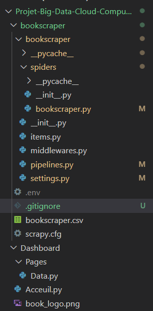
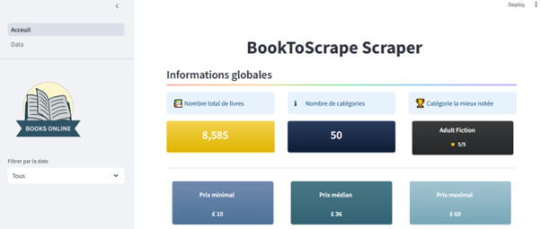
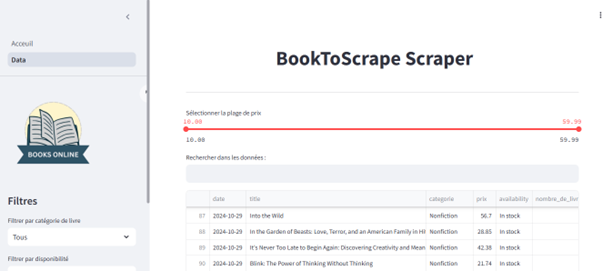
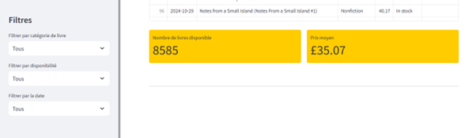

# Projet-Big-Data-Cloud-Computing-
*Application pour le suivi des prix des livres chez Books to Scrape*

**Description**

Ce projet est une application qui permet d'automatiser le suivi des prix via un programme (un scraper) développé en Python, capable d'extraire les informations tarifaires de la librairie en ligne Books to Scrape.  
A la suite de l’extraction des données, un tableau de bord interactif est développé avec Streamlit pour afficher des informations concernant essentiellement les prix de vente de livres. Ces informations présentées sous forme visuelle permettent aux utilisateurs d’explorer divers aspects des livres, comme les catégories, les prix et la disponibilité.  
## Prérequis
1.	Python 3.12.2 (**il faut utiliser une version < 3.13**)
2.	Les bibliothèques nécessaires sont à installer à partir du fichier *requirements.txt*
3.	Un compte AWS avec accès à un bucket S3 et clés d’accès AWS.
Pour executer l'application en local faire: 
4.	Créer un fichier *.env* contenant les informations suivantes : le nom du bucket, la clé d’accès au bucket, la clé secrète et le nom du fichier mis dans le fichier guide utilisateur.
5.  Créer le dossier *.streamlit* qui contient un fichier nommé *secrets.toml* qui contient les mêmes informations que ci-dessus.

## Installation
1. Cloner le projet
``git clone " https://github.com/GADO-Seman-Giovanni-Jocelyn/Projet-Big-Data-Cloud-Computing-"``
2. Création de l’environnement de travail  
``python -m venv venv`` 

3. Activation de l’environnement de travail 
``venv\Scripts\activate``    

En cas de demande d'autorisation taper *window+X* , cliquer sur windows PowerShell(admin)  puis taper ``Set-ExecutionPolicy RemoteSigned`` et autoriser l'accès. L'on pourra mettre à jour le pip après modification ``python.exe -m pip install --upgrade pip``

4. Installer les dépendances

``pip install -r requirements.txt ``   

5. Configurer les variables d'environnement : 

•	Créer un fichier *.env* à la racine du projet et y ajouter les informations AWS.  
## Arborescence des fichiers

## Structure du Projet

Description de certains fichiers

•	bookscraper.py : Spider Scrapy pour extraire les informations des livres.

•	pipelines.py : Pipeline de traitement des données et chargement vers AWS S3.

•	settings.py : Configuration du projet et gestion des paramètres Scrapy.

•	.env : Stockage sécurisé des clés AWS (non inclus dans le dépôt).

## Exécution du scraping

-	Afin de réaliser le scraping se placer dans dossier **bookscraper**( par exemple avec ``cd bookscraper`` dans le terminal)
-	Ensuite dans terminal executer: ``scrapy crawl books``  

Le spider parcourt le site et collecte les informations, qui sont ensuite enregistrées dans un fichier CSV. Une fois le scraping terminé, le fichier est automatiquement uploadé sur AWS S3.

## Visualisation du Dashboard

o 1ère possibilté : 
Accéder directement par le lien ci [bookscrapingensae](https://bookscrapingensae.streamlit.app/)

o 2ème possibilité :  
Après l’installation des prérequis pour le scraping, créer un dossier *.streamlit* (si ce n'est pas encore fait) dans le lequel sera mis le fichier *secrets.toml* comportant les identifiants vers le compartiment Amazon S3 (même identifiants que ceux du fichier *.env*).
Avant de lancer le dashboard, s’assurer que le repertoire courant est le dossier cloner.

Ensuite, lancer la commande ``streamlit run app.py`` dans le terminal.
Si vous n’avez pas de compte streamlit, il vous sera nécessaire de mettre une adresse mail
Si oui, le dashboard s’ouvrira dans votre navigateur par défaut
Vous pourrez ensuite parcourir le dashboard via le navigateur

La première page nommée Accueil présente les informations résumées sur les livres notamment le nombre total de livre, le nombre de categories, la categorie la mieux notée; le prix minimal, etc.

Il y a également les graphiques qui présentent la répartition des livres suivant les 10 plus grandes catégories ainsi que la répartion de la distribution du nombres de livres par classe de prix.

La deuxième page permet d'explorer la base entièrement avec la possibilité de filtrer suivant la categorie et la disponibilité des livres. On peut filtrer suivant des prix ou faire une recherche directement dans la base de données.

## Sources

• [Package Scrapy](https://docs.scrapy.org/en/latest/intro/tutorial.html)

• [Package Streamlit](https://docs.streamlit.io/)

## Contact
[kpakoum6@gmail.com] 